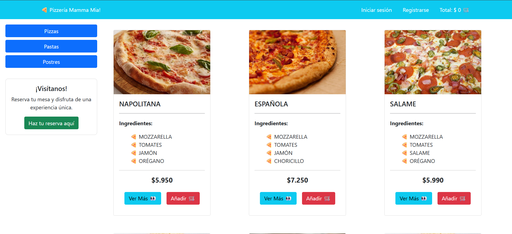

# 🍝 Mamma Mia  

Aplicación web de un restaurante desarrollada con **React** y **Bootstrap**.  
Permite a los usuarios **agregar productos al carrito**, **realizar reservas de mesas**, y cuenta con un **panel de administración** para gestionar las reservas.  

---

## 🚀 Demo
🔗 [Ver aplicación desplegada](https://mamma-mia-1.onrender.com/)  

---

## 📸 Vista previa


---

## 🛠️ Tecnologías utilizadas
- ⚛️ React  
- 🎨 Bootstrap  
- 📦 Vite  
- 🌐 Render (despliegue)
- 💾 PostgresSQL

---
## ✨ Funcionalidades principales

🛒 Agregar productos al carrito de compras
📅 Realizar reservas de mesas
🛠️ Panel de administración para gestionar y editar reservas
📱 Diseño responsive con Bootstrap

---
## ⚙️ Instalación y uso
1. Clona el repositorio:  
   ```bash
   git clone https://github.com/craguila14/mamma-mia.git
   cd mamma-mia
2. Instala las dependencias del frontend
   ```bash
   cd frontend
   npm install
3. Instala las dependencias del backend
   ```bash
   cd backend
   npm install
4. Configura las variables de entorno en el backend (crea un archivo .env)
    DB_USER, DB_PASSWORD, DB_HOST, DB_PORT, DB_DATABASE, JWT_SECRET,  EMAIL_USER, EMAIL_PASS (key de google para usar nodemailer)
5. Inicia el servidor del front
   ```bash
   npm run dev
6. Inicia el servidor del backend
   ```bash
   npm run start
